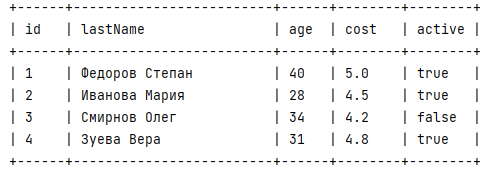

# Management data api

## Тестовое задание Школы Java-разработки Digital Design

__Цель:__ Решение тестового задания Школы Java-разработки Digital Design.

__Описание:__ Консольное приложение с некоторым подобием языка управления данными в базе данных, позволяющее оперировать данными в коллекции - таблице.

### Краткое описание приложения:
+ Структура коллекции - таблицы в приложении заранее определена.  
+ Изначально таблица пустая. Имеется только строка заголовков.
Таблица состоит из нескольких полей: id, lastName(имя человека), age(возраст), cost(оценка), active(активность).
Пример заполненной таблицы:

+ Поддерживаемые команды запроса к таблице: INSERT, SELECT, DELETE, UPDATE.
+ При выполнении запроса, осуществляется валидация на тип запроса, наличие поля в таблице данных, применяемый оператор запроса. При некорректном вводе бросается исключение. 
+ Данные таблицы выводятся на консоль в виде таблицы.
+ Колонки и команды запроса являются регистронезависимыми.
+ На время исполнения программы данные в коллекции сохраняются.
+ Приложение не имеет связи с консолью для считывания вводимых пользователем запросов.

### Технологии
+ OpenJDK 18

